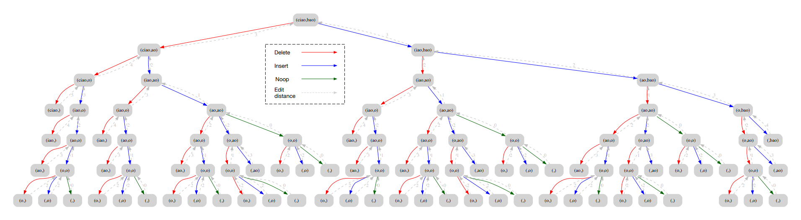

# Esercizio 2: algoritmo di calcolo dell’ edit-distance

## Testo dell’esercizio

Determinare la **distanza di edit** tra due stringhe (Editdistance): date due
stringhe **s1** e **s2** , non necessariamente della stessalunghezza, determinare il
minimo numero di operazioni necessarie per trasformarela stringa s2 in s1. Si
assuma che le operazioni disponibili siano: ***cancellazione*** e ***inserimento***.

Si implementi una versione ***ricorsiva*** ed una versione ***ricorsivo-dinamica***.

Si implementi un applicazione che usa la funzionein versione per _determinare,
per ogni parola w in ***correctme.txt**, la lista di parole in  **dictionary.txt** con edit
distance minima da w.*

## Algoritmo di calcolo dell’ edit-distance

Il calcolo dell’ **edit-distance** è un algoritmo ci sibasa sullo sfruttamento di tre
operazioni di modifica su stringhe: ***Inserimento*** , ***Rimozione*** e ***Noop***.
Sfruttando la funzione **rest()** possiamo ri-stamparele stringhe privandole del
primo carattere, così facendo possiamo verificare qual è il **tragitto minore** per
correggere una determinata parola sbagliata (o presuntatale) con una o più
parole con **edit-distance minimo** presenti nel dizionario.

La complessità dell'algoritmo, nella sua versione ricorsiva è **O(3^n)**.

Grazie alla versione dinamica della funzione possiamoevitare chiamate
ricorsive in eccesso, ottimizzando così la ricercadelle parole da suggerire per
la correzione. In particolare, se il calcolo è giàstato computato, è possibile
ritornare il risultato in tempo **O(1)**.

## Guida all’utilizzo

Qui di seguito, i comandi make per l’utilizzo delprogramma:
- **make all** : compila e crea l’eseguibile per il maine le unit tests;
- **make tests** : compila, crea ed esegue il programma perle unit tests;
- **make main** : compila, crea ed esegue il programma main;

## Decisioni di Sviluppo

Come citato in precedenza, l’obiettivo dell’esercizioè l’implementazione di un
applicativo che usufruisce della versione dinamicadell’algoritmo per il calcolo
delle parole ad *edit-distance **minimo** , per ognuna presentein **correctme.txt**.*

L'applicativo verte su tre strutture dati principali:

- **Dictionary** : array di stringhe contenente tutte leparole del file
dictionary.txt. La scelta di utilizzare un array èdovuta alla
minimizzazione del numero di operazioni di I/O sufile.
- **Word list** : struct contenente la lista dinamica delleparole suggerite per
una singola stringa (si assuma che la singola parolasia presa dal file
correctme.txt ). La struct contiene info aggiuntivequali la parola stessa,
l’edit distance minimo calcolato della lista e iltempo impiegato per
calcolarla.
- **Edit distancer** : lista dinamica di Word List, creataper memorizzare le
Word list per ogni parola presente in correctme.txt.

Per dare più scelta e visualizzare le info principali,è possibile passare il nome
del file da correggere come parametro e, a fine correzione,i risultati per le
parole con **edit-distance = 0** (le parole corrette,trovate nel dizionario)
possono essere filtrate.

Il ***tempo medio di esecuzione*** dell’applicativo, testato su più macchine con
capacità differenti, è di circa 50 secondi.
